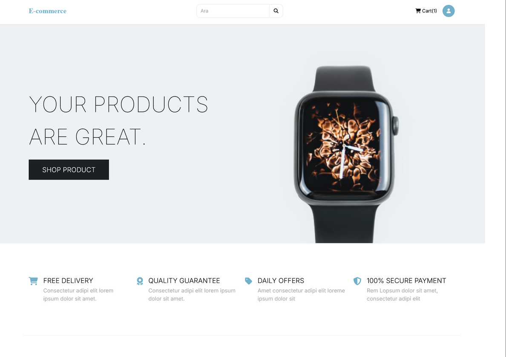
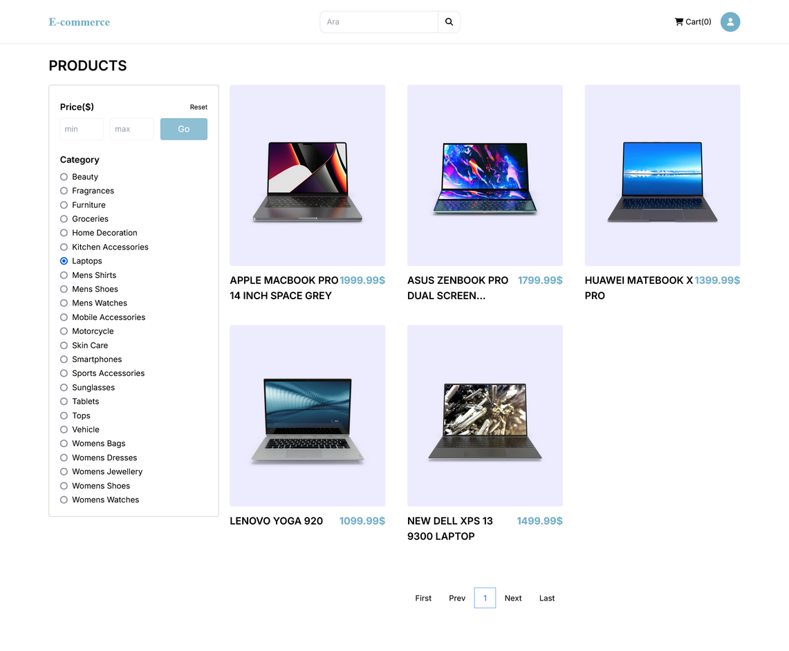
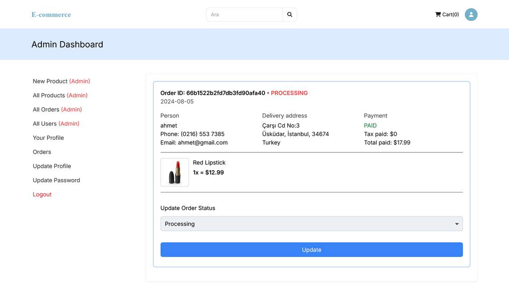

# 🛒 Next.js + MongoDB + Stripe E-commerce App

This is a full-stack e-commerce web application built with **Next.js**, **MongoDB**, and **Stripe**. Users can browse products, add items to a cart, and make secure payments via Stripe. The backend handles product management and order processing, all within the Next.js framework.

## 🚀 Features

- Product listing & detail pages
- Shopping cart functionality
- Secure checkout using Stripe
- Admin dashboard to manage products
- Optional user authentication & authorization
- Responsive design (mobile-friendly)

## 🛠️ Technologies Used

- **Next.js** – React framework with SSR/SSG support
- **MongoDB + Mongoose** – Database and ODM
- **Stripe API** – Payment processing
- **Tailwind CSS** – Utility-first CSS framework
- **NextAuth** – Authentication
- **Vercel** – Deployment





## 📦 Getting Started

Follow the steps below to run the project locally:

### 1. Clone the Repository

```bash
git clone https://github.com/mussarri/next-ecommerce.git
cd next-ecommerce
npm install
```

### 2. Set Up Environment Variables
```
STRIPE_WEBHOOK_SECRET
STRIPE_SECRET
STRIPE_PK
HOSTNAME
DOMAIN
NEXTAUTH_SECRET
NEXT_PUBLIC_API_URL
API_URL=
DATABASE_URL=mongodb+srv://
```

### 3. Run Locally
```
npm run dev
```

